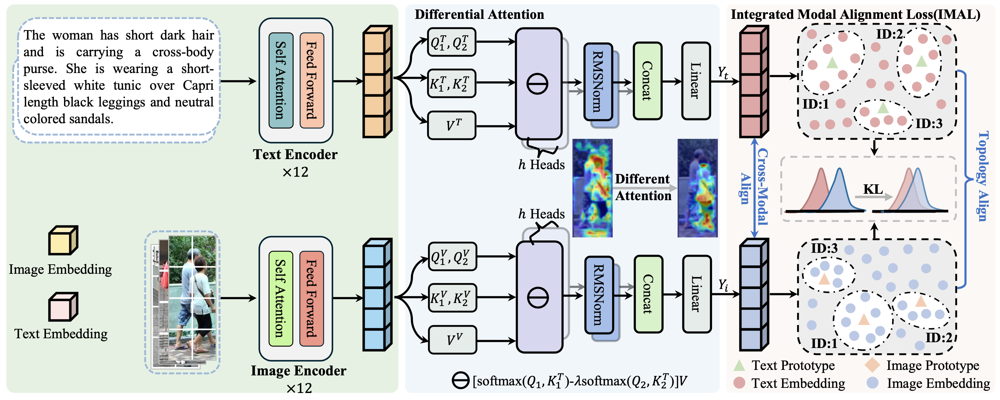

# CCMA:Consistency-Driven Cross-Modal Alignment for Text-to-Image Person Re-Identification
[](https://github.com/anosorae/IRRA/blob/main/LICENSE) [](https://paperswithcode.com/sota/nlp-based-person-retrival-on-cuhk-pedes?p=cross-modal-implicit-relation-reasoning-and)


## Highlights
We tackle two major challenges in text-based person retrieval—Cross-modal Misalignment Bias (CMB) and Intra-modal Semantic Overlap (ISO). To this end, we design a Differential Attention mechanism that suppresses irrelevant features by subtracting cross-modal attention maps, and propose an Integrated Modal Alignment Loss (IMAL) that unifies cross-modal alignment and intra-modal consistency. Extensive experiments on three benchmarks demonstrate that our framework achieves state-of-the-art performance with consistent improvements in retrieval accuracy and robustness.

## Abstrct
Text-based person retrieval aims to search for target images from large-scale datasets using textual descriptions.  However, the imbalance of multimodal data often makes the image modality more complex, containing background redundancy and multi-target interference, which leads to Cross-modal Misalignment Bias (CMB).  Moreover, most existing methods implicitly assume a one-to-one mapping between images and texts, neglecting the prevalent overlap of textual descriptions, thus causing Intra-modal Semantic Overlap (ISO). To address these challenges, we propose a CCMA framework.  Specifically, we design a Differential Attentionmechanism that explicitly suppresses irrelevant or noisy features and focuses on semantically relevant regions, thereby enhancing local feature discriminability and cross-modal consistency to alleviate CMB.  In addition, we introduce an Integrated Modal Alignment Loss (IMAL) that regularizes intra-modal neighborhood structures to improve feature compactness and semantic consistency, effectively mitigating ISO.  Extensive experiments on three public datasets demonstrate the effectiveness of our method, achieving state-of-the-art performance, including gains of 0.91% in Rank-1, 0.42% in mAP, and 0.54% in mINP on CUHK-PEDES.

## Usage
### Requirements
we use single RTX3090 24G GPU for training and evaluation. 
```
pytorch 1.9.0
torchvision 0.10.0
prettytable
easydict
```

### Prepare Datasets
Download the CUHK-PEDES dataset from [here](https://github.com/ShuangLI59/Person-Search-with-Natural-Language-Description), ICFG-PEDES dataset from [here](https://github.com/zifyloo/SSAN) and RSTPReid dataset form [here](https://github.com/NjtechCVLab/RSTPReid-Dataset)

Organize them in `your dataset root dir` folder as follows:
```
|-- your dataset root dir/
|   |-- <CUHK-PEDES>/
|       |-- imgs
|            |-- cam_a
|            |-- cam_b
|            |-- ...
|       |-- reid_raw.json
|
|   |-- <ICFG-PEDES>/
|       |-- imgs
|            |-- test
|            |-- train 
|       |-- ICFG_PEDES.json
|
|   |-- <RSTPReid>/
|       |-- imgs
|       |-- data_captions.json
```


## Training

```python
python train.py \
--name ccma \
--img_aug \
--batch_size 64 \
--MLM \
--loss_names 'imal' \
--dataset_name 'CUHK-PEDES' \
--root_dir 'your dataset root dir' \
--num_epoch 60
```

## Testing

```python
python test.py --config_file 'path/to/model_dir/configs.yaml'
```

## IRRA on Text-to-Image Person Retrieval Results
#### Comparison of different methods on CUHK-PEDES, ICFG-PEDES, and RSTPReid datasets.
| Method      | Type | Ref     | CUHK-PEDES R@1 | CUHK-PEDES R@10 | CUHK-PEDES mAP | ICFG-PEDES R@1 | ICFG-PEDES R@10 | ICFG-PEDES mAP | RSTPReid R@1 | RSTPReid R@10 | RSTPReid mAP |
|-------------|------|---------|----------------|-----------------|----------------|----------------|-----------------|----------------|--------------|---------------|--------------|
| IRRA  | G    | CVPR23  | 73.11          | 93.58           | 66.02          | 63.46          | 85.82           | 38.06          | 60.20        | 88.20         | 47.17        |
| VGSG   | G    | TIP23   | 71.38          | 91.86           | 67.91          | 63.05          | 84.36           | -              | -            | -             | -            |
| EESSO | L    | IVC24   | 69.57          | 90.71           | -              | 60.84          | 83.53           | -              | 53.15        | 83.55         | -            |
| CFAM | L    | CVPR24  | 73.67          | 93.57           | 65.94          | 63.57          | **86.32**       | 38.34          | 60.51        | 89.71         | 47.64        |
| MACF | L    | IJCV24  | 73.33          | 93.02           | -              | 62.95          | 85.04           | -              | -            | -             | -            |
| CSKT | L    | ICASSP24| 69.70          | 91.80           | 62.74          | 58.90          | 83.56           | 33.87          | 57.75        | 88.35         | 46.43        |
| SAMC | G    | TIFS24  | 74.00   | 93.31           | **68.42**      | 63.68          | 85.21           | 42.21          | 60.80        | 89.00         | **49.67**    |
| LERF | L    | PR25    | 65.84          | 90.22           | -              | 57.23          | 83.11           | -              | 46.75        | 81.60         | -            |
| MMRef | G    | TMM25   | 72.25          | 92.61           | -              | 63.50          | 83.73           | -              | 56.20        | 85.80         | -            |
| VFE-TPS (19)| L    | KBS25   | 72.47          | 93.24           | 64.26          | 62.71          | 84.51           | **43.08**      | 59.25        | 88.85         | 45.96        |
| DM-Adapter | G  | AAAI25  | 72.17          | 92.85           | 64.33          | 62.64          | 85.32           | 36.50          | 60.00        | 87.90         | 47.37        |
| CCMA (Ours) | G    | -       | **74.03**      | **93.68**       | 66.44          | **63.76**      | 86.00           | 38.30          | **60.80**    | **89.00**     | 47.90        |

[Model & log for CUHK-PEDES](https://drive.google.com/file/d/1jTubHy5420VITUStPXr0P0uQDK93Gf09/view)
[Model & log for ICFG-PEDES](https://drive.google.com/file/d/1K43tbLqu_yAxeNBKAqoTcuug3meubxfx/view?usp=sharing)
[Model & log for RSTPReid](https://drive.google.com/file/d/1UWbRqA0G0ubtzhyHvzP11jbDpXtCg_Fp/view?usp=sharing)


